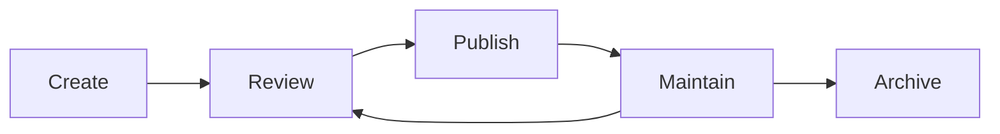

# Documentation Standards & Guidelines

This document establishes comprehensive standards for documentation across the Mermaid & YANG Visualizer project to ensure consistency, quality, and maintainability.

## Table of Contents

- [General Principles](#general-principles)
- [File Organization](#file-organization)
- [Markdown Standards](#markdown-standards)
- [Code Documentation](#code-documentation)
- [API Documentation](#api-documentation)
- [Release Documentation](#release-documentation)
- [Quality Assurance](#quality-assurance)
- [Accessibility Guidelines](#accessibility-guidelines)
- [Maintenance Process](#maintenance-process)

## General Principles

### 1. Clarity and Conciseness
- Write for your audience - assume basic technical knowledge but explain complex concepts
- Use simple, direct language
- Break down complex topics into digestible sections
- Include examples wherever possible

### 2. Consistency
- Follow established patterns and terminology
- Use consistent formatting throughout all documents
- Maintain uniform voice and tone
- Apply the same structure across similar document types

### 3. Completeness
- Cover all essential information for the target audience
- Include both "what" and "why" explanations
- Provide troubleshooting guidance
- Add links to related documentation

### 4. Accuracy
- Keep documentation synchronized with code changes
- Validate all code examples and links
- Review documentation during code reviews
- Update version-specific information regularly

## File Organization

### Required Files

Every project must include:

```
README.md              # Project overview and quick start
CLAUDE.md             # Claude Code specific instructions
docs/
├── DOCUMENTATION_STANDARDS.md  # This file
├── VERSION_MANAGEMENT.md        # Version management process
├── RELEASE_PROCESS.md          # Release workflow
└── releases/                   # Individual release notes
    ├── v2.1.0.md
    └── v2.0.0.md
```

### Optional but Recommended

```
CHANGELOG.md          # Historical changes
CONTRIBUTING.md       # Contribution guidelines
LICENSE.md           # Project license
docs/
├── ARCHITECTURE.md   # System architecture
├── API.md           # API documentation
├── TROUBLESHOOTING.md # Common issues and solutions
└── examples/        # Usage examples
    ├── basic-usage.md
    └── advanced-features.md
```

### File Naming Conventions

- Use `kebab-case` for file names: `feature-documentation.md`
- Use `SCREAMING_SNAKE_CASE` for important root files: `README.md`, `LICENSE.md`
- Version files: `vX.Y.Z.md` format
- Date-based files: `YYYY-MM-DD-description.md`

## Markdown Standards

### 1. Headers

- Use ATX-style headers (`#` syntax) consistently
- Maintain logical hierarchy (H1 → H2 → H3, don't skip levels)
- Capitalize headers using title case
- Add blank lines before and after headers

```markdown
# Main Title (H1)

## Section Title (H2)

### Subsection Title (H3)

Content here...

## Next Section (H2)
```

### 2. Lists

- Use `-` for unordered lists (consistent bullet style)
- Use `1.` for ordered lists
- Indent sub-items with 2 spaces
- Add blank lines between list items when they contain multiple paragraphs

```markdown
- First item
- Second item
  - Sub-item
  - Another sub-item
- Third item

1. First step
2. Second step
   - Sub-step
   - Another sub-step
3. Third step
```

### 3. Code Blocks

- Always specify the language for syntax highlighting
- Use descriptive language identifiers
- Include comments in complex examples
- Test all code examples before publishing

```markdown
```javascript
// Example: Initialize Mermaid diagram
import mermaid from 'mermaid';

mermaid.initialize({
  theme: 'default',
  startOnLoad: true
});
```

```bash
# Install dependencies
npm install

# Run development server
npm run dev
```
```

### 4. Links

- Use descriptive link text (avoid "click here")
- Prefer relative links for internal documentation
- Validate all external links regularly
- Use reference-style links for repeated URLs

```markdown
<!-- Good -->
[View the API documentation](docs/API.md)
[Mermaid.js official documentation](https://mermaid.js.org/)

<!-- Avoid -->
[Click here](docs/API.md)
```

### 5. Images

- Always include meaningful alt text
- Use relative paths for local images
- Optimize images for web (reasonable file sizes)
- Include captions when helpful

```markdown


*Figure 1: High-level architecture of the Mermaid & YANG Visualizer*
```

### 6. Tables

- Use proper table formatting with aligned columns
- Include headers for all tables
- Keep table content concise
- Use code formatting for technical values

```markdown
| Command | Description | Example |
|---------|-------------|---------|
| `npm run dev` | Start development server | Port 3000 |
| `npm run build` | Build for production | Creates `dist/` |
| `npm test` | Run test suite | Jest + Playwright |
```

## Code Documentation

### 1. JSDoc Standards

All JavaScript/TypeScript functions must include JSDoc comments:

```javascript
/**
 * Renders a Mermaid diagram from markdown content
 * @param {string} content - The mermaid diagram definition
 * @param {string} elementId - Target DOM element ID
 * @param {Object} options - Rendering options
 * @param {string} options.theme - Theme name ('default', 'dark', etc.)
 * @param {boolean} options.startOnLoad - Whether to render immediately
 * @returns {Promise<string>} Promise resolving to rendered SVG
 * @throws {Error} When diagram syntax is invalid
 * @example
 * const svg = await renderMermaidDiagram(
 *   'graph TD; A-->B',
 *   'diagram-container',
 *   { theme: 'dark' }
 * );
 */
async function renderMermaidDiagram(content, elementId, options = {}) {
  // Implementation...
}
```

### 2. Component Documentation

React components require comprehensive documentation:

```tsx
/**
 * Interactive diagram component with zoom and export functionality
 *
 * @component
 * @example
 * const diagram = { id: '1', title: 'Flow Chart', content: 'graph TD; A-->B' };
 * return (
 *   <InlineDiagram
 *     diagram={diagram}
 *     onOpenFullscreen={(id) => console.log('Open:', id)}
 *     theme="dark"
 *   />
 * );
 */
interface InlineDiagramProps {
  /** Diagram data object */
  diagram: DocumentDiagram;
  /** Callback when fullscreen is requested */
  onOpenInMermaidViewer?: (diagramId: string) => void;
  /** UI theme preference */
  theme?: 'light' | 'dark';
}
```

### 3. Configuration Documentation

Document all configuration options with examples:

```javascript
// Configuration object for diagram rendering
const CONFIG = {
  // Mermaid theme settings
  theme: {
    primary: '#1976d2',     // Primary color for diagrams
    secondary: '#dc004e',   // Secondary/accent color
    background: '#ffffff'   // Background color
  },

  // Export settings
  export: {
    format: 'svg',          // Default export format: 'svg' | 'png' | 'pdf'
    quality: 2,             // Image quality multiplier (1-4)
    maxSize: 4096          // Maximum dimension in pixels
  }
};
```

## API Documentation

### 1. Endpoint Documentation

Document all API endpoints with complete examples:

```markdown
### POST /api/files/upload

Uploads one or more files to the server for processing.

**Parameters:**
- `files` (multipart/form-data): Array of files to upload

**Supported file types:**
- `.md` - Markdown files with embedded diagrams
- `.mmd`, `.mermaid` - Pure Mermaid diagram files
- `.yang` - YANG model files

**Request Example:**
```bash
curl -X POST http://localhost:3000/api/files/upload \
  -F "files=@diagram.md" \
  -F "files=@model.yang"
```

**Response Example:**
```json
{
  "success": true,
  "files": [
    {
      "id": "file_001",
      "name": "diagram.md",
      "size": 1024,
      "type": "markdown"
    }
  ]
}
```

**Error Responses:**
- `400` - Invalid file format or size exceeded
- `413` - Request too large (>10MB per file)
- `500` - Server error during processing
```

### 2. Error Documentation

Document all possible error conditions:

```markdown
## Error Handling

All API endpoints return standardized error responses:

```json
{
  "success": false,
  "error": {
    "code": "VALIDATION_ERROR",
    "message": "File size exceeds 10MB limit",
    "details": {
      "field": "file",
      "received": "12582912 bytes",
      "limit": "10485760 bytes"
    }
  }
}
```

### Error Codes

| Code | Description | Action |
|------|-------------|--------|
| `VALIDATION_ERROR` | Invalid input parameters | Check request format |
| `FILE_TOO_LARGE` | File exceeds size limit | Reduce file size |
| `UNSUPPORTED_FORMAT` | File type not supported | Use supported formats |
```

## Release Documentation

### 1. Release Notes Format

Use consistent formatting for all releases:

```markdown
### Version 2.1.0 (2024-09-18)

🚀 **New Features**
- Document View Tab with inline diagram rendering
- Multi-architecture Docker support (ARM64 + AMD64)
- Interactive diagram controls with zoom and pan

🐛 **Bug Fixes**
- Fixed Safari compatibility issues with export functionality
- Resolved close button behavior in fullscreen mode

📚 **Documentation**
- Complete API documentation update
- Enhanced troubleshooting guides

🔧 **Technical Improvements**
- Implemented semantic versioning automation
- Enhanced error handling system

⚠️ **Breaking Changes**
- Updated API endpoint structure (see migration guide)

**Migration Guide:** [v2.0-to-v2.1-migration.md](docs/migrations/v2.0-to-v2.1-migration.md)
```

### 2. Version Management

- Follow semantic versioning (MAJOR.MINOR.PATCH)
- Use automation scripts for version increments
- Tag all releases in git
- Maintain version history file

```json
{
  "versions": [
    {
      "version": "2.1.0",
      "type": "minor",
      "date": "2024-09-18",
      "timestamp": "2024-09-18T10:30:00Z",
      "previousVersion": "2.0.1"
    }
  ]
}
```

## Quality Assurance

### 1. Documentation Review Checklist

Before publishing documentation:

- [ ] Content accuracy verified
- [ ] All links tested and functional
- [ ] Code examples tested
- [ ] Formatting consistent
- [ ] Grammar and spelling checked
- [ ] Accessibility guidelines followed
- [ ] Version information current

### 2. Automated Checks

Use provided tools for quality assurance:

```bash
# Quick validation
./scripts/validate-documentation.sh

# Comprehensive QA analysis
./scripts/docs-qa-agent.js

# Link checking
./scripts/docs-qa-agent.js --links-only
```

### 3. Regular Maintenance

- **Weekly**: Review and update version-specific content
- **Monthly**: Validate all external links
- **Quarterly**: Comprehensive documentation audit
- **Per Release**: Update all relevant documentation

## Accessibility Guidelines

### 1. Structure

- Use proper heading hierarchy
- Include table of contents for long documents
- Use descriptive section titles
- Break up long paragraphs

### 2. Images and Media

- Provide alt text for all images
- Include captions for complex diagrams
- Use high contrast colors
- Ensure text is readable at various zoom levels

### 3. Navigation

- Include breadcrumb navigation where appropriate
- Use consistent link styling
- Provide skip-to-content links for long pages
- Test with keyboard-only navigation

## Maintenance Process

### 1. Documentation Lifecycle



### 2. Update Triggers

Update documentation when:
- Code functionality changes
- New features are added
- Bugs are fixed
- APIs are modified
- Dependencies are updated
- User feedback indicates confusion

### 3. Review Process

1. **Self-Review**: Author checks own work against standards
2. **Peer Review**: Technical reviewer validates accuracy
3. **Editorial Review**: Check for clarity and consistency
4. **User Testing**: Validate with actual users when possible
5. **Final Approval**: Maintainer approves for publication

### 4. Continuous Improvement

- Monitor documentation usage analytics
- Collect user feedback
- Track common support questions
- Regular documentation health assessments

## Tools and Resources

### Recommended Tools

- **Writing**: VS Code with Markdown extensions
- **Diagramming**: Mermaid.js, draw.io
- **Link Checking**: Built-in docs-qa-agent.js
- **Grammar**: Grammarly, LanguageTool
- **Screenshots**: Built-in OS tools with consistent styling

### Style Guides

- **Writing**: [Microsoft Writing Style Guide](https://docs.microsoft.com/en-us/style-guide/)
- **Code**: Project ESLint configuration
- **API**: [OpenAPI Specification](https://spec.openapis.org/)

### Templates

Standard templates are available in `docs/templates/`:
- `feature-documentation.md`
- `api-endpoint.md`
- `troubleshooting-guide.md`
- `release-notes.md`

---

## Enforcement

This document is enforced through:
- Automated git hooks (pre-commit validation)
- Documentation QA agent (comprehensive checks)
- Code review process (manual validation)
- Regular audits (monthly quality assessments)

For questions about these standards, please refer to the project maintainers or file an issue in the project repository.

---

**Last Updated**: 2024-09-18
**Version**: 1.0.0
**Next Review**: 2024-12-18