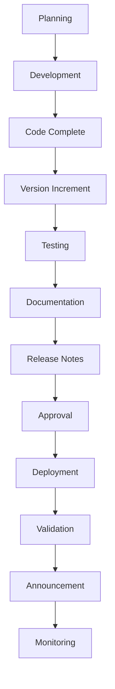

# Release Process Guide

This document outlines the complete release process for the Mermaid & YANG Visualizer project, from planning through deployment and post-release activities.

## Overview

Our release process is designed to ensure:
- **Quality**: Thorough testing and validation
- **Consistency**: Standardized procedures and documentation
- **Automation**: Minimal manual intervention
- **Traceability**: Complete audit trail
- **Rollback Capability**: Safe deployment with recovery options

## Release Types

### 1. Patch Release (x.y.Z)
- **Frequency**: As needed for critical fixes
- **Timeline**: 1-2 days
- **Approval**: Development team lead
- **Testing**: Automated tests + smoke testing

### 2. Minor Release (x.Y.z)
- **Frequency**: Monthly or feature-driven
- **Timeline**: 1-2 weeks
- **Approval**: Product owner + development lead
- **Testing**: Full test suite + user acceptance testing

### 3. Major Release (X.y.z)
- **Frequency**: Quarterly or as needed
- **Timeline**: 2-4 weeks
- **Approval**: Full stakeholder review
- **Testing**: Comprehensive testing + beta release

## Release Workflow



## Phase 1: Planning

### Pre-Release Checklist

- [ ] **Feature Scope Defined**
  - Requirements documented
  - Acceptance criteria established
  - Breaking changes identified

- [ ] **Timeline Established**
  - Development milestones
  - Testing phases
  - Release date target

- [ ] **Resources Allocated**
  - Development team assigned
  - Testing resources available
  - Documentation writers identified

### Release Branch Strategy

For minor and major releases:

```bash
# Create release branch from main
git checkout main
git pull origin main
git checkout -b release/v2.2.0

# Continue development on release branch
# Cherry-pick critical fixes if needed
```

## Phase 2: Development

### Code Development Guidelines

1. **Feature Development**
   - Implement features according to specifications
   - Follow coding standards and practices
   - Write comprehensive tests
   - Update inline documentation

2. **Code Review Process**
   - All changes require peer review
   - Use pull request workflow
   - Automated checks must pass
   - Manual testing required for UI changes

3. **Testing Integration**
   - Unit tests for new functionality
   - Integration tests for API changes
   - E2E tests for user workflows
   - Performance benchmarking

## Phase 3: Code Complete

### Definition of "Code Complete"

- [ ] All planned features implemented
- [ ] All tests passing
- [ ] Code coverage targets met
- [ ] Documentation updated
- [ ] No critical or high-priority bugs
- [ ] Performance benchmarks met

### Pre-Release Validation

```bash
# Run comprehensive test suite
cd frontend && npm run test
cd ../backend && npm test

# Validate build process
docker build -t mermaid-yang-app -f docker/Dockerfile .

# Check documentation quality
./scripts/docs-qa-agent.js

# Validate version consistency
node scripts/sync-package-versions.js --dry-run
```

## Phase 4: Version Increment

### Automated Version Management

```bash
# For patch releases
./scripts/increment-version.sh patch "Fix critical export bug"

# For minor releases
./scripts/increment-version.sh minor "Add Document View and HTML export"

# For major releases
./scripts/increment-version.sh major "Migrate to React 18 with breaking changes"
```

### Manual Verification

After version increment:

1. **Check Package Files**
   ```bash
   grep '"version"' frontend/package.json backend/package.json
   ```

2. **Verify Git Tags**
   ```bash
   git tag -l "v*" | tail -5
   git show $(git describe --tags --abbrev=0)
   ```

3. **Validate Version History**
   ```bash
   cat version-history.json | jq '.versions[0]'
   ```

## Phase 5: Testing

### Test Levels by Release Type

#### Patch Release Testing
- [ ] Automated unit tests
- [ ] Automated integration tests
- [ ] Smoke tests for affected functionality
- [ ] Regression testing for related features

#### Minor Release Testing
- [ ] Full automated test suite
- [ ] Manual testing of new features
- [ ] Cross-browser compatibility testing
- [ ] Performance regression testing
- [ ] User acceptance testing

#### Major Release Testing
- [ ] Comprehensive test coverage
- [ ] End-to-end user journey testing
- [ ] Load and stress testing
- [ ] Security vulnerability scanning
- [ ] Beta testing with external users
- [ ] Migration testing from previous versions

### Testing Environment Setup

```bash
# Development testing
docker-compose up dev --build

# Production-like testing
docker build -t mermaid-yang-app -f docker/Dockerfile .
docker run -p 3000:3000 mermaid-yang-app

# Automated testing
cd frontend
npm run test:e2e
npm run test:unit
```

### Test Documentation

Document test results in:
- `docs/testing/release-v2.2.0-test-report.md`
- Include pass/fail status
- Note any known issues
- Performance benchmarks
- Browser compatibility matrix

## Phase 6: Documentation

### Documentation Requirements

- [ ] **README.md Updates**
  - New features documented
  - Installation instructions current
  - Usage examples updated
  - Breaking changes highlighted

- [ ] **API Documentation**
  - New endpoints documented
  - Changed endpoints updated
  - Deprecated endpoints marked
  - Examples tested and validated

- [ ] **Migration Guides** (for breaking changes)
  - Clear upgrade path
  - Code examples for changes
  - Known issues and workarounds
  - Timeline for deprecated features

- [ ] **Release-Specific Documentation**
  - Feature announcements
  - Technical architecture changes
  - Performance improvements
  - Security enhancements

### Documentation Validation

```bash
# Run documentation QA
./scripts/docs-qa-agent.js

# Quick validation
./scripts/validate-documentation.sh

# Manual review checklist
# - All links functional
# - Code examples tested
# - Screenshots current
# - Formatting consistent
```

## Phase 7: Release Notes

### Automated Generation

```bash
# Generate release notes from commits
node scripts/generate-release-notes.js

# Generate since specific version
node scripts/generate-release-notes.js v2.1.0
```

### Manual Enhancement

Enhance automated notes with:
- **User Impact**: How changes affect end users
- **Migration Requirements**: Steps needed for upgrade
- **Known Issues**: Any limitations or workarounds
- **Acknowledgments**: Contributors and testers

### Release Notes Template

```markdown
### Version 2.2.0 (2024-10-15)

**Summary**
This release introduces enhanced Docker support and improved documentation management.

🚀 **New Features**
- Multi-architecture Docker builds (ARM64 + AMD64)
- Automated version management system
- Comprehensive documentation QA tools

🐛 **Bug Fixes**
- Fixed Safari export compatibility issues
- Resolved Docker build failures on ARM systems

📚 **Documentation**
- Added comprehensive API documentation
- New troubleshooting guides
- Migration guide for Docker changes

🔧 **Technical Improvements**
- Improved build performance by 40%
- Enhanced error handling across components
- Standardized logging format

⚠️ **Breaking Changes**
- Docker port changed from 3000 to 8080 (see migration guide)
- API endpoint `/api/old-upload` removed (use `/api/files/upload`)

**Migration Guide**: [v2.1-to-v2.2-migration.md](docs/migrations/v2.1-to-v2.2-migration.md)

**Full Changelog**: https://github.com/project/compare/v2.1.0...v2.2.0
```

## Phase 8: Approval

### Approval Matrix

| Release Type | Required Approvals |
|-------------|--------------------|
| Patch | Development Lead |
| Minor | Development Lead + Product Owner |
| Major | Development Lead + Product Owner + Stakeholders |

### Approval Checklist

- [ ] **Technical Review**
  - Code quality assessment
  - Security review completed
  - Performance benchmarks met
  - Test coverage adequate

- [ ] **Product Review**
  - Features meet requirements
  - User experience validated
  - Documentation complete
  - Breaking changes acceptable

- [ ] **Stakeholder Review** (Major releases)
  - Business impact assessment
  - Resource allocation approved
  - Timeline acceptable
  - Communication plan ready

## Phase 9: Deployment

### Pre-Deployment

```bash
# Final validation
docker build -t mermaid-yang-app:v2.2.0 -f docker/Dockerfile .
docker run --rm -p 3000:3000 mermaid-yang-app:v2.2.0

# Tag and push
git push origin main
git push --tags

# Create GitHub release (if applicable)
gh release create v2.2.0 --title "Version 2.2.0" --notes-file release-notes-v2.2.0.md
```

### Deployment Steps

1. **Build Production Image**
   ```bash
   ./scripts/build-multiarch.sh mermaid-yang-app:v2.2.0
   ```

2. **Deploy to Production**
   ```bash
   docker stop mermaid-yang-app || true
   docker rm mermaid-yang-app || true
   docker run -d \
     --name mermaid-yang-app \
     -p 3000:3000 \
     -v $(pwd)/uploads:/app/uploads \
     --restart unless-stopped \
     mermaid-yang-app:v2.2.0
   ```

3. **Health Check**
   ```bash
   curl -f http://localhost:3000/api/health || exit 1
   ```

### Rollback Plan

```bash
# If deployment fails, rollback to previous version
docker stop mermaid-yang-app
docker run -d \
  --name mermaid-yang-app \
  -p 3000:3000 \
  mermaid-yang-app:v2.1.0

# Revert git tag if needed
git tag -d v2.2.0
git push origin --delete v2.2.0
```

## Phase 10: Validation

### Post-Deployment Checks

- [ ] **Service Health**
  - Application starts correctly
  - All endpoints responding
  - Database connections working
  - File uploads functional

- [ ] **Feature Validation**
  - New features working as expected
  - No regression in existing features
  - Performance within acceptable ranges
  - Error handling working properly

- [ ] **Integration Testing**
  - API endpoints responding correctly
  - Frontend-backend integration working
  - External dependencies functional
  - User workflows complete end-to-end

### Monitoring

```bash
# Check application logs
docker logs mermaid-yang-app --tail=100

# Monitor resource usage
docker stats mermaid-yang-app

# Test key user journeys
curl -X POST http://localhost:3000/api/files/upload
curl -X GET http://localhost:3000/api/health
```

## Phase 11: Announcement

### Communication Channels

1. **Internal Team**
   - Slack/Teams notification
   - Email to stakeholders
   - Update project documentation

2. **External Users**
   - GitHub release notes
   - Project website update
   - Social media announcement (if applicable)

3. **Documentation**
   - Update README.md
   - Publish release notes
   - Update version in all documentation

### Announcement Template

```markdown
🎉 **Release Announcement: Mermaid & YANG Visualizer v2.2.0**

We're excited to announce the release of version 2.2.0, featuring:

✨ **Highlights**
- Multi-architecture Docker support for ARM64 and AMD64
- Automated version management system
- Enhanced documentation with quality assurance tools

🔧 **Improvements**
- 40% faster build times
- Enhanced error handling
- Improved Safari compatibility

📚 **Documentation**
- New API documentation
- Comprehensive troubleshooting guides
- Migration assistance for Docker changes

**Get Started**: [Installation Guide](README.md#quick-start)
**Full Release Notes**: [v2.2.0 Release Notes](docs/releases/v2.2.0.md)
**Migration Guide**: [v2.1 to v2.2 Migration](docs/migrations/v2.1-to-v2.2-migration.md)

Thank you to all contributors who made this release possible! 🙏
```

## Phase 12: Monitoring

### Post-Release Monitoring

- **First 24 Hours**: Active monitoring for issues
- **First Week**: Daily check-ins and user feedback collection
- **First Month**: Weekly monitoring and performance analysis

### Key Metrics

- Application uptime and availability
- Response times for key endpoints
- Error rates and types
- User adoption of new features
- Performance compared to previous version

### Issue Response Plan

1. **Critical Issues** (system down, data loss)
   - Immediate rollback if needed
   - Emergency fix and patch release
   - Post-mortem analysis

2. **High Priority Issues** (major functionality broken)
   - Fix within 24-48 hours
   - Patch release within a week
   - User communication about workarounds

3. **Medium/Low Priority Issues**
   - Include in next scheduled release
   - Document as known issues
   - Provide workarounds if available

## Release Retrospective

### Post-Release Review

After each release, conduct a retrospective meeting to discuss:

1. **What Went Well**
   - Successful processes and tools
   - Effective communication
   - Quality of deliverables

2. **Areas for Improvement**
   - Process bottlenecks
   - Tool limitations
   - Communication gaps

3. **Action Items**
   - Process improvements
   - Tool updates
   - Training needs

### Continuous Improvement

- Update release process documentation based on lessons learned
- Enhance automation to reduce manual effort
- Improve testing coverage and effectiveness
- Streamline approval processes where possible

---

**Last Updated**: 2024-09-18
**Version**: 1.0.0
**Next Review**: After next major release

This document should be reviewed and updated after each major release to incorporate lessons learned and process improvements.