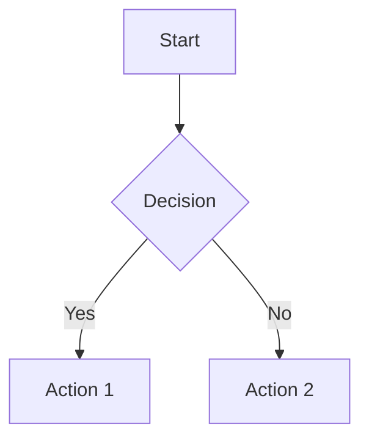
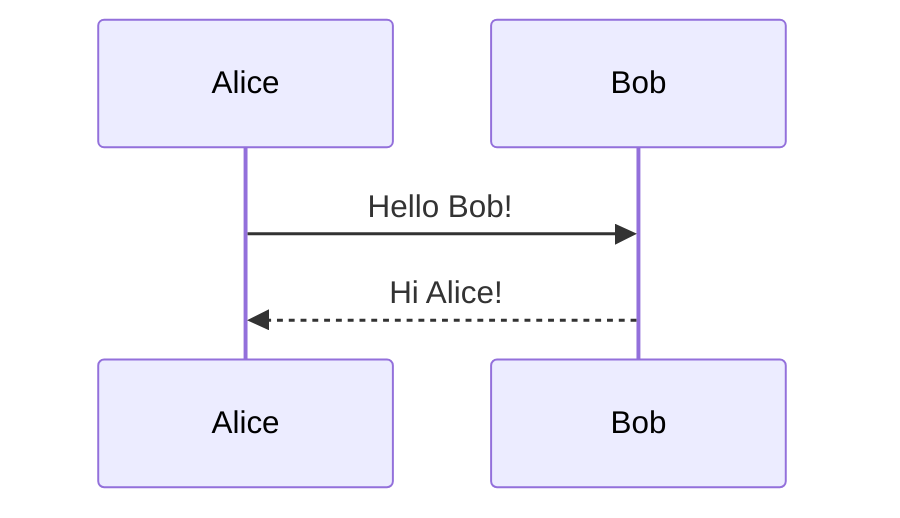
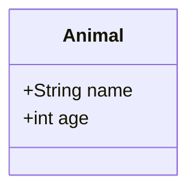

# Sample Document with Mermaid Diagrams

This is a test document containing multiple Mermaid diagrams.

## Flowchart Example

```mermaid
graph TD
    A[Start] --> B{Decision}
    B -->|Yes| C[Action 1]
    B -->|No| D[Action 2]
```

## Sequence Diagram Example

```mermaid
sequenceDiagram
    Alice->>Bob: Hello Bob!
    Bob-->>Alice: Hi Alice!
```

## Class Diagram Example

```mermaid
classDiagram
    class Animal {
      +String name
      +int age
    }
```
