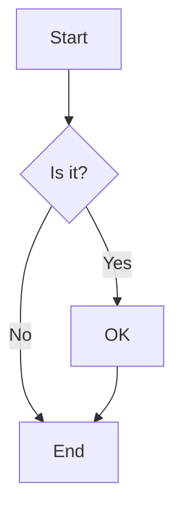
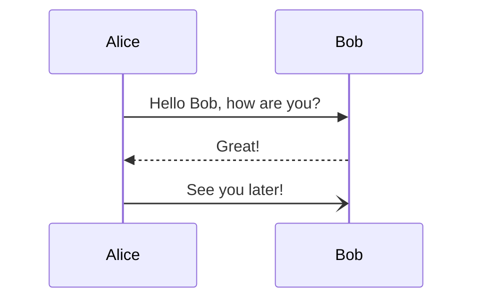
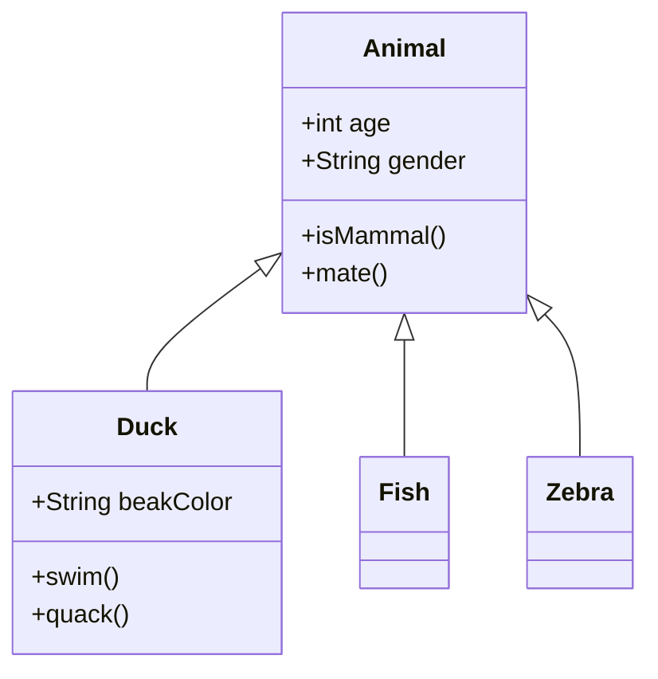
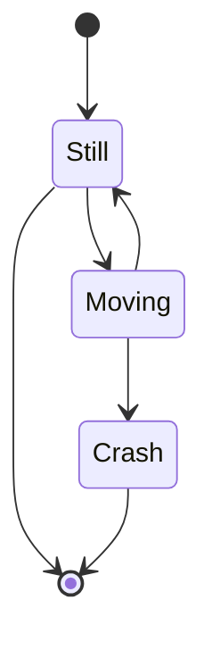
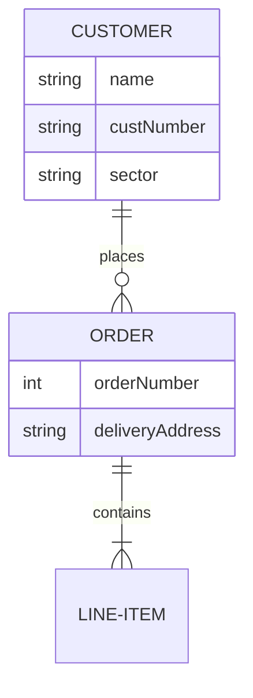
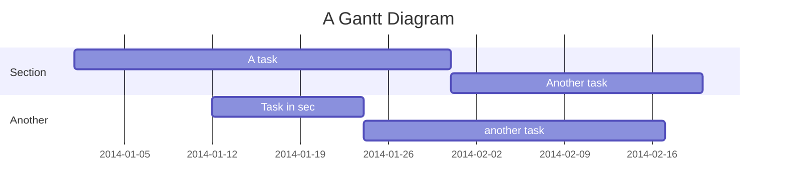
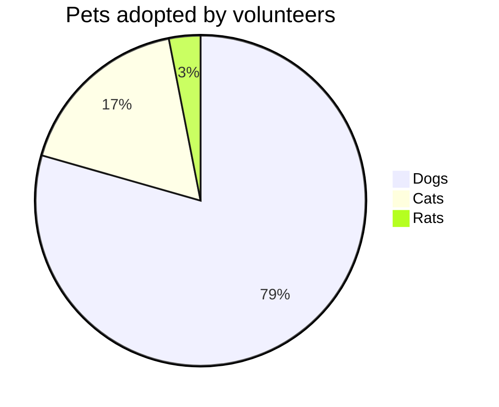
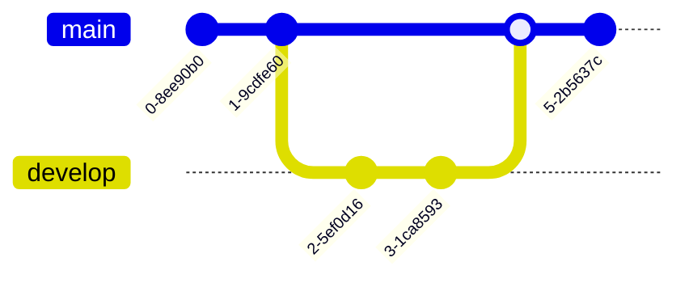

# Test Document

This is a test document with 10 diagram(s).

## Diagram 1

## Diagram 2

## Diagram 3

## Diagram 4

## Diagram 5

## Diagram 6

## Diagram 7

## Diagram 8

## Diagram 9

## Diagram 10

