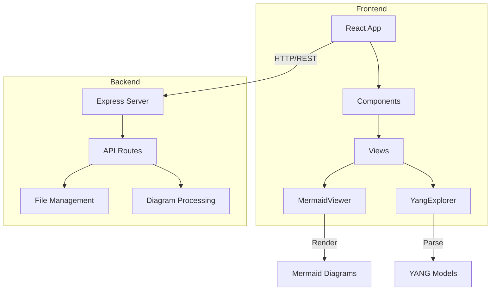
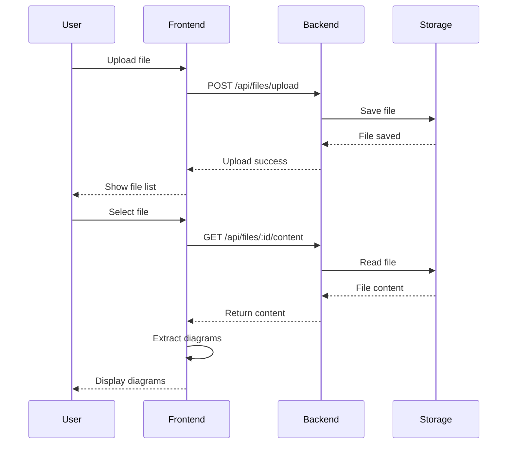
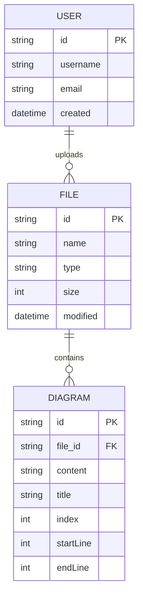
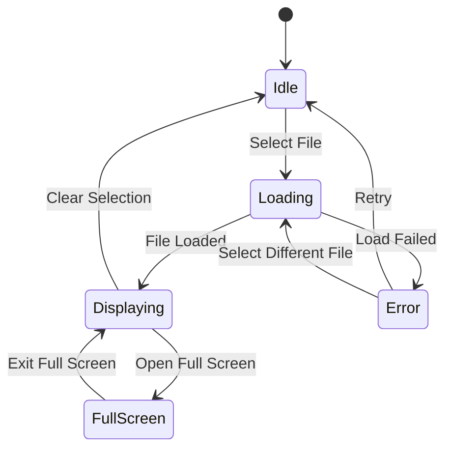
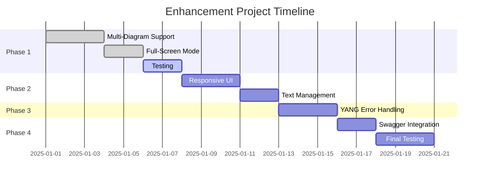
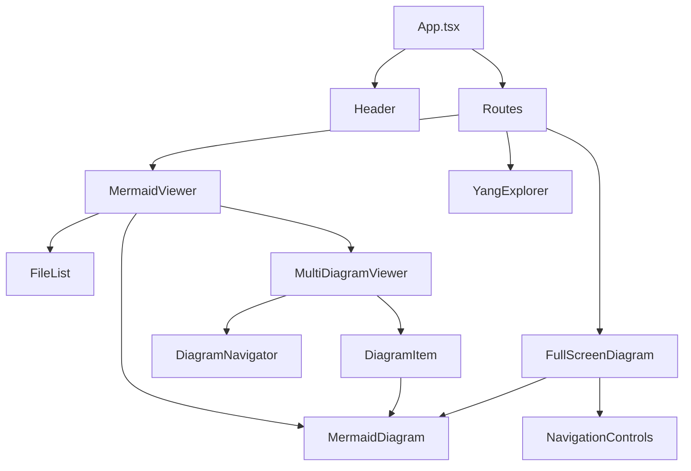
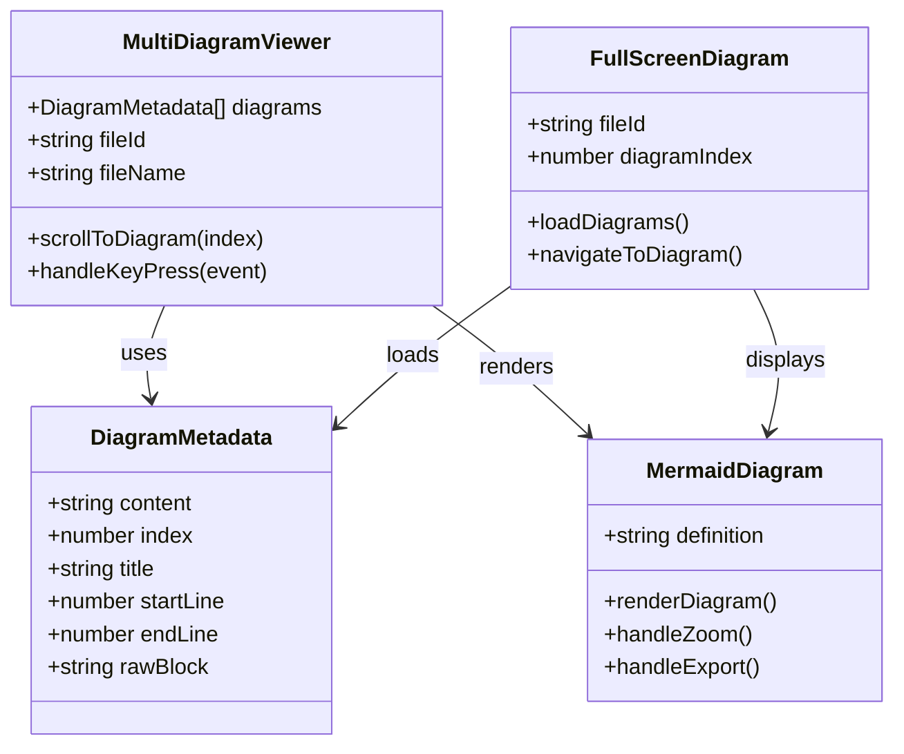
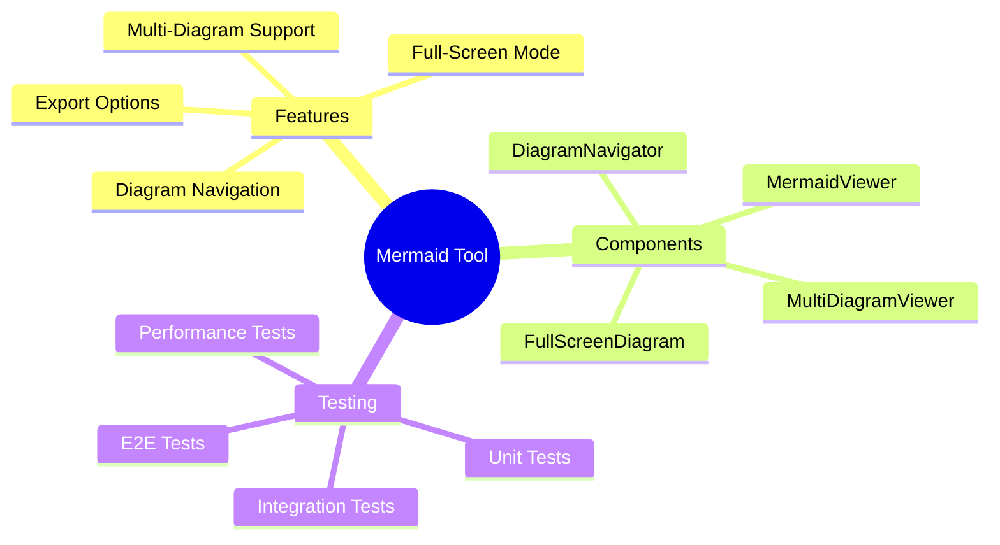

# Multi-Diagram Test Document

This document contains multiple Mermaid diagrams to test the multi-diagram support feature.

## System Architecture

## User Flow Diagram

The following diagram shows the user interaction flow:

## Database Schema

## State Machine

## Project Timeline

## Component Hierarchy

## Class Diagram

## Mind Map

## End of Document

This completes the test document with 8 different Mermaid diagrams of various types.